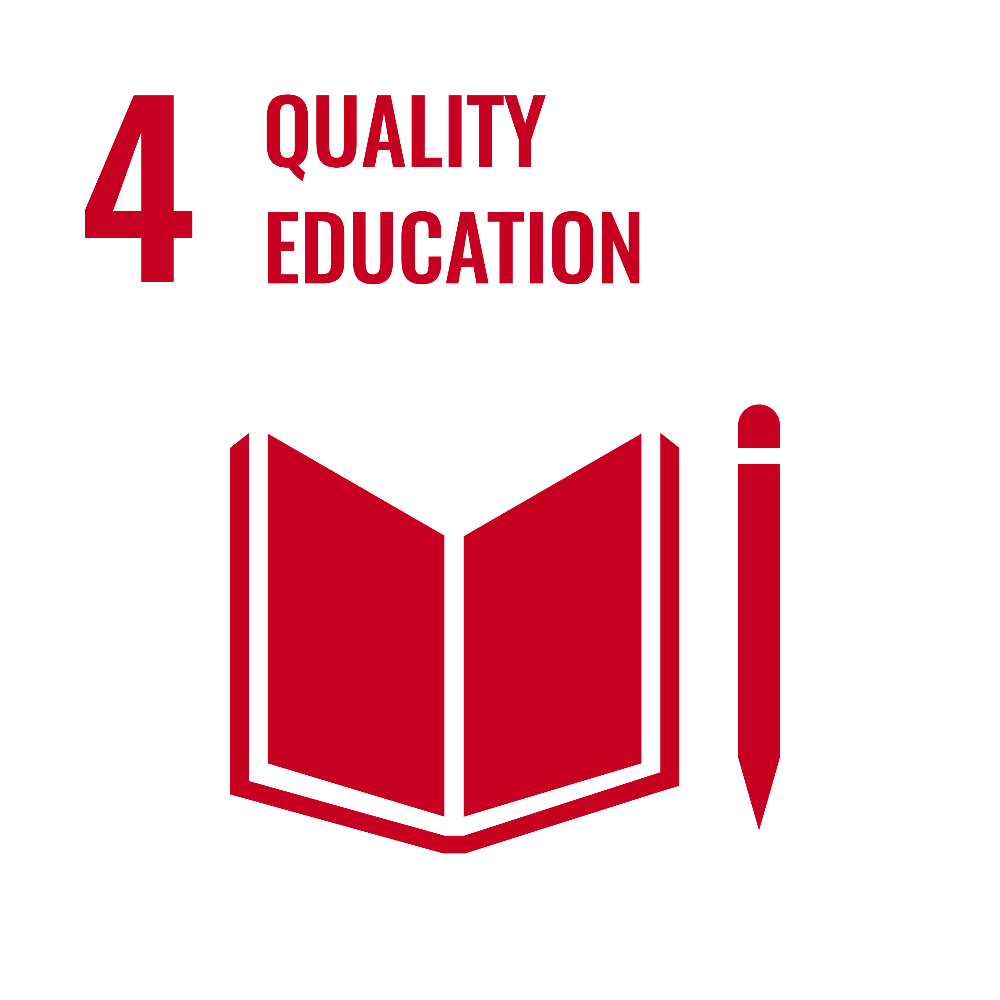
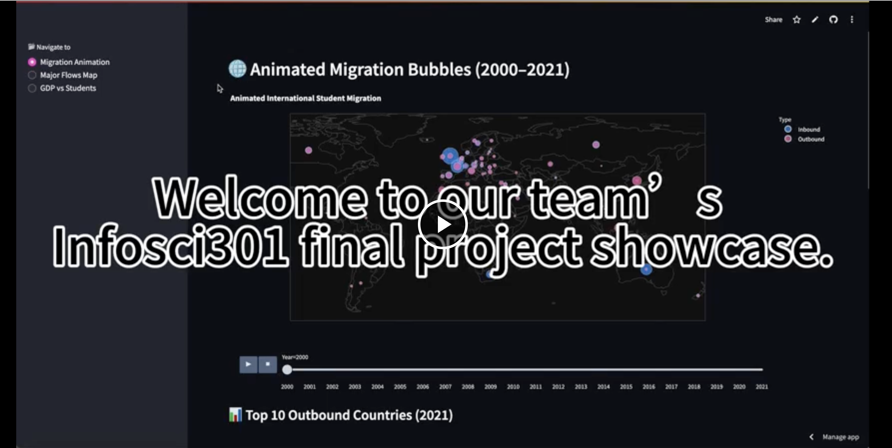
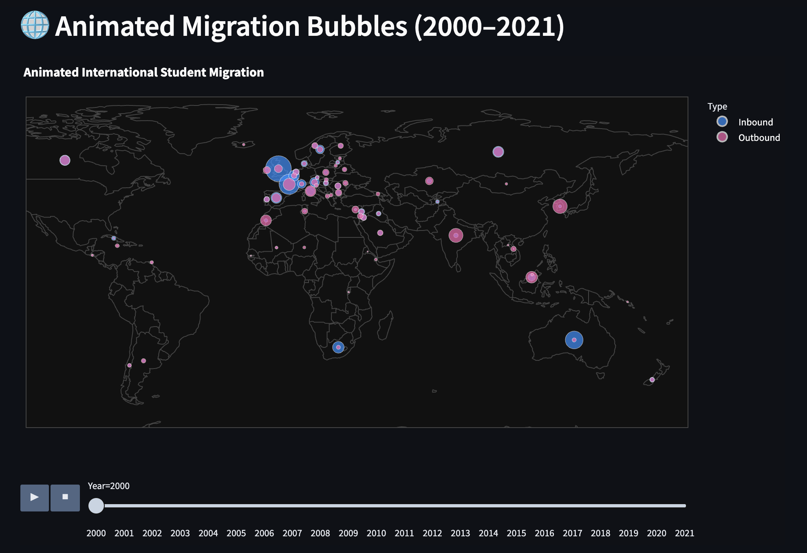
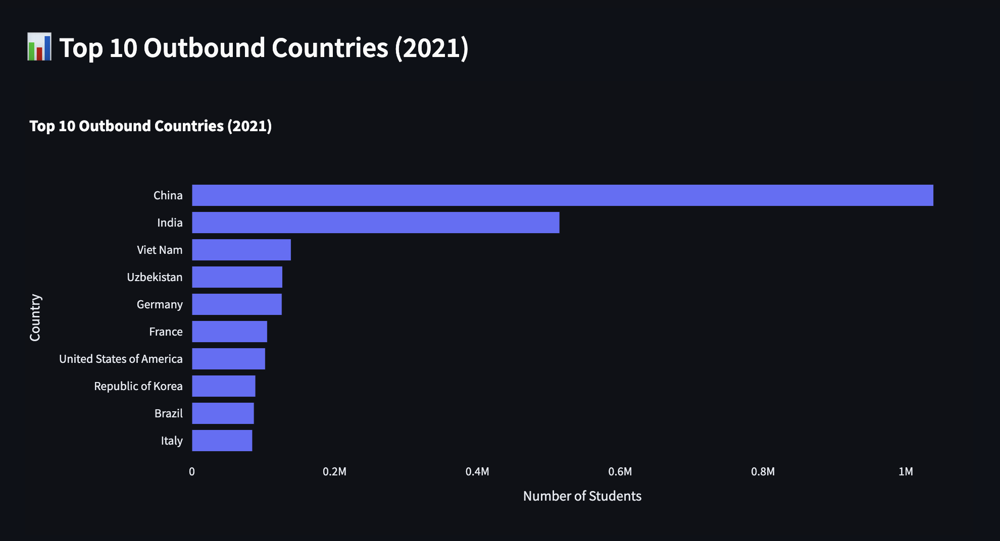
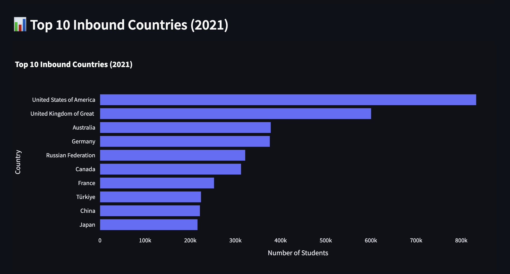
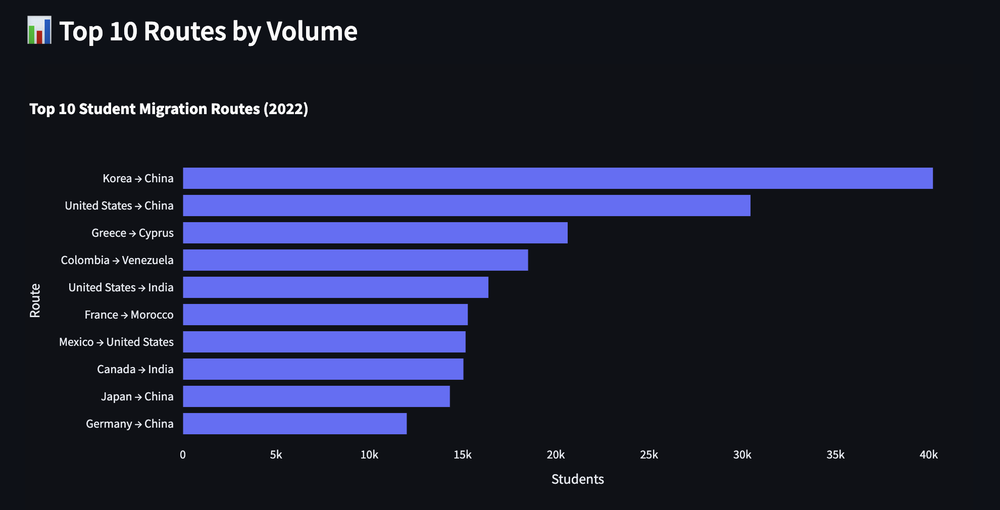
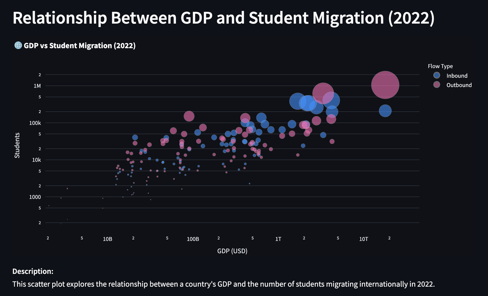
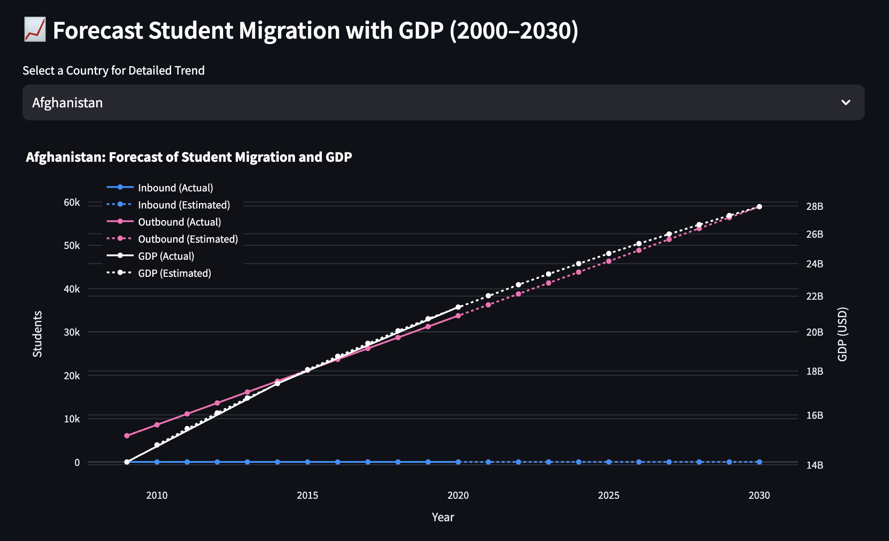

# 🌍 INFOSCI301 Final Project

## Title: “Global Student Mobility Dashboard: Visualizing International Education Flows and Economic Correlations”

### Team Contribution Statement

- **Yiqing Wang**: Data acquisition and transformation, initial visualizations, GitHub repo organization  
- **Nemuulen Togtbaatar**: Literature review, design improvements, GDP forecasting, deployment

---

### Project Overview
This project analyzes global trends in international student mobility by examining inbound and outbound student flows across countries over time. By integrating UNESCO Institute for Statistics (UIS) mobility data with World Bank GDP indicators, we explore the relationship between a country's economic status and its role in international education exchanges.


---

### Acknowledgments
- Professor Luyao (Sunshine) Zhang’s insightful guidance and lectures throughout the course and our classmates’ thoughtful feedback and shared enthusiasm were essential in the completion of this project.
- A special thanks to Dongping Liu from Amazon and David Schaaf, the Deputy Head of Chemistry Education and Head of the NanoBioLab at Saarland University, for their great lectures introducing new visualization technologies.
---

### Contribution to SDG 4
This project contributes to SDG 4 (Quality Education) by:
- Highlighting global disparities in access to international education.
- Promoting data-driven awareness of trends in educational migration.
- Supporting conversations around equity in educational opportunities and resources worldwide.
By visualizing these mobility trends, our project encourages actions toward **promoting equitable access to international education opportunities**.
<div align="center">

</div>

🔗 **Live App**: [infosci301finalproject.streamlit.app](https://infosci301finalproject-j34vzlrqpnbbp22g879wld.streamlit.app/?embed_options=dark_theme)

🎥 **Demo video**: 
[](https://duke.box.com/s/1upqgdtsr2qphtmh19cwumnjz4yzb684) - A short video showing the website functionality.

---

### 📌 Table of Contents
- [Project Overview](#project-overview)
- [Acknowledgments](#acknowledgments)
- [Team Members & Contributions](#team-contribution-statement)
- [Contribution to the SDGs](#contribution-to-sdg-4)
- [Repository Structure & Navigation](#repository-structure-&-navigation)
- [Technical Details](#technical-details)
- [Project Report](#project-report)
- [Statement of Learning & Growth](#statement-of-intellectual-and-professional-growth)

### 📁 Repository Structure & Navigation

```bash
INFOSCI301_Final_Project/
│
├── code/                # Streamlit app, Python scripts, utilities
│   └── app.py           # Main application file
│
├── data/                # All processed datasets
│   ├── GDP.csv
│   ├── inbound_intl.csv
│   ├── ...
│   └── README.md        # Data sources & preprocessing steps
│
├── visualizations/      # PNG/SVG outputs or pilot visualizations
│
├── docs/                # Report
│   └── Final_Report.pdf
│
├── requirements.txt     # Environment setup
└── README.md            # You're here
```
---

### Technical details

- **Programming Language**: Python
- **Data Manipulation**: `pandas`
- **Data Visualization**: `plotly`, `matplotlib`
- **Web Framework**: `streamlit`
- **Development Environment**: Google Colab, VS code
- **Version Control**: GitHub
 
---
## Project Report

### Research Questions
- Which countries are the largest senders and receivers of international students, and how does this correlate with their GDP?
- How have student mobility patterns evolved over the past two decades, particularly in relation to economic changes and what is the future direction?
- Are there identifiable regional trends in student migration linked to economic indicators?

### Scholarly Grounding
We draw design inspiration from:

> Schöttler, S., Hinrichs, U., & Bach, B. (2025).  
> *Practices and Strategies in Responsive Thematic Map Design.*  
> IEEE Transactions on Visualization and Computer Graphics (TVCG).
> https://doi.org/10.1109/TVCG.2024.3456352

This paper highlights challenges in thematic map design, such as overlapping symbols, navigation difficulties, and loss of context, and suggests strategies like dynamic scaling and interactive features. Our project adapts these ideas to create accessible, responsive migration visualizations.

### Workflow Pipeline

- **Data Acquisition**: Sources include World Bank, UNESCO UIS, and OECD datasets.
- **Data Cleaning**: Handling excess values, reshaping wide/long formats, and matching country names.
- **Visualization Planning**: Identifying key metrics (GDP, inbound/outbound numbers) and appropriate visualization types.
- **Visualization Coding**: Using Python libraries (pandas, plotly) and Google Colab for development.
- **Data Analysis**: Exploring trends, regional differences, and economic correlations.
- **Report and Deployment**: Documenting findings on GitHub with organized code, results, and a project poster.

### Datasets Used
| Dataset | Source |
|:--------|:-------|
| **GDP.csv** | [World Bank GDP Data](https://data.worldbank.org/indicator/NY.GDP.MKTP.CD) |
| **Government expenditure on education as % of GDP (%).csv** | [World Bank Education Expenditure](https://data.worldbank.org/indicator/SE.XPD.TOTL.GD.ZS) |
| **Country_names.csv** | UNESCO UIS (self-created lookup) |
| **inbound-outbound_intl.csv** | [UNESCO UIS Data](https://uis.unesco.org/bdds) |
| **inbound_intl.csv** | [UNESCO UIS Data](https://uis.unesco.org/bdds) |
| **Share_students_origin_to_destination.csv** | [OECD Data Explorer](https://data-explorer.oecd.org) |
| **Total_num_students_going_abroad.csv** | [OECD Data Explorer](https://data-explorer.oecd.org) |

### Visualizations
- **Main Animated Map**: Displays changing inbound and outbound student volumes globally from 2000–2021.
- **GDP vs Students Scatter Plot**: Shows correlation between GDP and student mobility numbers across countries over time.
- **2022 Flows Map**: Focuses on 2022 only, visualizing student flows between origin and destination countries via connecting lines.

### Data Analysis: Overall Trends in International Student Migration (2000–2021)




Between 2000 and 2021, international student migration patterns underwent significant transformations, reflecting broader trends in globalization, economic development, and educational access.

In 2000, the landscape of international education was relatively concentrated. A small group of developed countries — particularly those in Western Europe, North America, and Oceania - acted as the primary destinations for mobile students. Inbound flows were modest in scale and largely limited to traditional education hubs like France, Germany, the United Kingdom, Australia, and the United States. Meanwhile, outbound flows from developing countries were present but relatively limited, both in volume and in geographic reach.
As the decade progressed, the 2010 snapshot revealed the early signs of a more interconnected world. A larger number of countries began to engage actively in sending and receiving students. Notably, China, India, and Southeast Asian nations exhibited growing outbound migration. Inbound hubs such as Australia and the UK expanded further, while Europe as a whole solidified its position as a central magnet for international students.

By 2021, international student mobility had not only intensified but diversified. Inbound flows into major economies became significantly larger, represented by the dramatic growth in bubble sizes. The United States, Australia, the United Kingdom, and Germany emerged as dominant global destinations. At the same time, China rose sharply as the world's largest sender of outbound students, followed by India and other Asian economies. Outbound migration patterns became more dispersed, no longer concentrated in a handful of nations but rather involving a wider range of countries from different regions.

Throughout these two decades, several overarching trends can be observed:
- Expansion and Diversification: Both the number of mobile students and the number of participating countries increased dramatically, reflecting a broader democratization of international education.
- Economic Correlation: Wealthier nations consistently attract higher numbers of inbound students, suggesting that economic strength remains a key driver of educational migration.
Rise of Asia: Asia shifted from being predominantly a source of outbound students to becoming a crucial player in shaping global mobility patterns, both as senders and increasingly as receivers.
- Resilience Despite Challenges: Even in the face of global disruptions such as the COVID-19 pandemic, the data shows sustained student flows in 2021, underscoring the resilience and continued demand for international education.
- hese findings highlight how global education has evolved into a complex, multi-directional network of opportunities, aligning closely with Sustainable Development Goal 4 (SDG 4), which advocates for inclusive and equitable quality education and the promotion of lifelong learning opportunities for all.


### Data Analysis: Major Student Flows (2022) 




The 2022 international student flow map reveals several key insights:
Dominant Destinations: The United States and the United Kingdom remain the largest recipients of international students. Thick lines represent major inflows from Asia, Europe, and Latin America.

- Emerging Intra-Asia Mobility: A significant volume of students is moving between Asian countries, particularly from India, Vietnam, and Bangladesh to destinations such as Japan, South Korea, and Malaysia. This trend highlights the strengthening role of regional education hubs in Asia.
- European Educational Connectivity: Europe shows dense internal student mobility, with strong educational exchanges between EU countries. Initiatives like Erasmus likely contribute to this vibrant intra-European student movement.
- Latin American Patterns: Latin American students, especially from Brazil, Colombia, and Argentina, predominantly head toward the United States and Spain for higher education opportunities.
- Access Gaps: Sparse outbound flows from Sub-Saharan Africa point to ongoing challenges in equitable access to international education pathways.
Overall, the 2022 snapshot visualizes a complex, multi-centered network of global student mobility, demonstrating both traditional and emerging educational migration routes.


### Data Analysis: Relationship Between GDP and Student Migration (2022)




The scatter plot reveals several important trends between a country's economic strength and its international student flows:
- Positive Correlation: Generally, countries with higher GDP levels tend to have higher numbers of both inbound and outbound international students. This suggests that economic resources enable better access to education abroad and greater attractiveness as education destinations.
- Top Economies Dominate: Economies like the United States, China, Germany, and the United Kingdom are positioned in the upper right, indicating they are both major sources and hosts of international students.
- Outbound Mobility from Developing Economies: Several developing countries with moderate GDPs (e.g., India, Vietnam, Nigeria) show relatively high outbound student numbers, reflecting strong demand for education abroad despite economic constraints.
- Inbound Disparities: Some wealthy countries have relatively fewer inbound students compared to their GDP size, suggesting that factors beyond economics, such as language, visa policies, or educational reputation, also impact inbound attractiveness.
- Outliers and Exceptions: A few smaller economies (e.g., Malaysia, the UAE) punch above their economic weight by attracting large numbers of international students, indicating the emergence of new regional education hubs.
Overall, the scatter plot highlights the economic dimension of global education mobility and points to persistent inequalities in access and destination attractiveness.

### Statement of Intellectual and Professional Growth

This project marks a leap from static infographics to an interactive, multi-layered visualization product.

Throughout this project, we experienced a significant learning curve that strengthened both our technical and collaborative capacities. We learned how to manage a complex pipeline—from sourcing and cleaning international datasets to deploying a live visualization dashboard—while maintaining consistency and clarity in our narrative. Working as a team, we each took on different but interconnected roles in design, analysis, and development, gaining a deeper appreciation for the interdisciplinary nature of data visualization. Our work also challenged us to reflect on broader issues of equity, inclusion, and accessibility in how we communicate data. Importantly, this project helped us connect our academic interests to real-world challenges, particularly those aligned with the UN Sustainable Development Goals. Through each step, we developed a more critical and creative perspective on how data can inform, inspire, and empower decision-making in global education.

Based on our classmates’ feedback, we improved the first visualization by making it animated. To better support government decision-making, we also created individual graphs for each country, showing the relationship between GDP and student numbers, along with projections through 2030.

The Zhouzhuang field trip reminded us that meaningful communication—whether about the body or the world—requires care in tone, empathy in design, and attention to accessibility.


### Competing Interests

The authors declare no competing interests.
